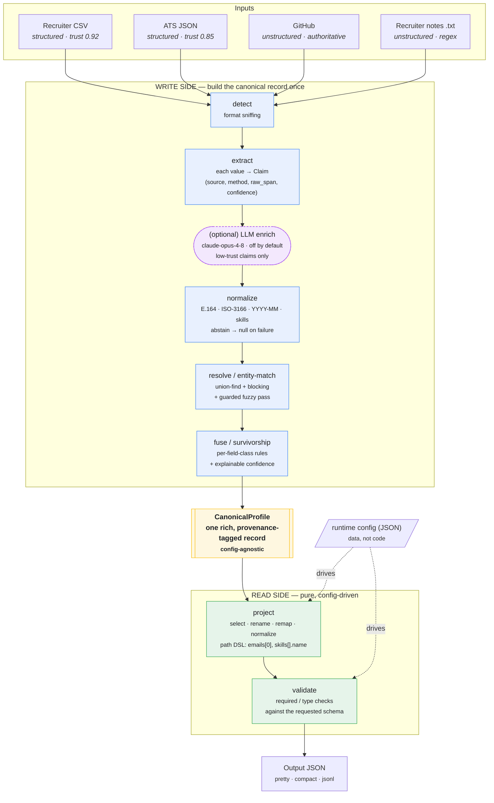

# Eightfold — Canonical Candidate Profile Transformer

> Turn messy, conflicting, multi-source candidate data into **one clean, canonical,
> provenance-tagged profile** — with a **runtime config** that reshapes the output without
> touching the engine.


**Governing principle:** *wrong-but-confident is worse than honestly-empty.* When a value can't
be trusted, the pipeline **abstains to `null`** — it never invents.

📄 One-page design / "how I think": [`docs/design.md`](docs/design.md)

---

## Table of contents

- [Introduction](#introduction)
- [Quickstart](#quickstart)
- [Features](#features)
- [Architecture](#architecture)
- [Runtime config (the required twist)](#runtime-config-the-required-twist)
- [Conflict resolution (survivorship)](#conflict-resolution-survivorship)
- [Design decisions](#design-decisions)
- [Scaling to production](#scaling-to-production)
- [Project layout](#project-layout)

---

## Introduction

Candidate data is never clean. The same person arrives as a recruiter CSV row, an ATS export
with foreign field names, a GitHub profile, and a paragraph of recruiter notes — with conflicting
names, three formats for the same phone number, and skills written five different ways.

This project **reconciles those sources into a single golden record** where every field knows
*where it came from* and *how much to trust it*. It treats the problem as **deterministic data
engineering with full lineage**, not as text generation — so the output is reproducible,
explainable, and safe to put in front of a recruiter.

The design follows **CQRS** (Command/Query Responsibility Segregation):

- **Write side** — build one rich, over-complete canonical record *once*.
- **Read side** — a pure, deterministic projection layer reshapes that record per a runtime
  config. The config is *data fed to a generic projector* — never branching logic in the engine.

Every value enters the system as a **`Claim`** carrying `source`, `method`, `raw_span`, and
`extracted_confidence`, so **provenance and confidence are invariants from birth**, not features
bolted on at the end.

---

## Quickstart

### 1. Install (Python 3.10+)

```bash
python3 -m venv .venv && source .venv/bin/activate
pip install -e ".[dev]"
```

### 2. Run on the sample inputs — **default** schema

```bash
eightfold run --inputs samples/inputs --out out_default.json
```

### 3. Run with a **custom** runtime config (subset + remap + normalize)

```bash
eightfold run --inputs samples/inputs --config config/example_custom.json --out out_custom.json
```

The per-source run report prints to **stderr**; the JSON document goes to **stdout** (or `--out`).

> **Useful flags:** `--jsonl` (one candidate per line), `--compact`, `--strict` (non-zero exit if
> any source failed or candidate errored), `--llm` (optional Claude enrichment).

### Minimal web UI (optional)

```bash
python web/app.py            # then open http://127.0.0.1:8000
```

Point it at an inputs folder, paste/edit a config, and view the produced profile JSON.
Intentionally low-polish — a thin viewer over the same engine the CLI uses.

### Optional: Claude enrichment of free text

Off by default. Enable with `--llm` **and** an `ANTHROPIC_API_KEY` set:

```bash
export ANTHROPIC_API_KEY=sk-...
eightfold run --inputs samples/inputs --llm --out out_llm.json
```

`claude-opus-4-8` (structured JSON output, **cached by input-hash** for reproducibility) only
*proposes* low-confidence skill/headline claims that can **never overwrite** a structured value.
Without a key it's a no-op — the run is byte-identical to the deterministic path.

### Run the tests

```bash
pytest -q              # 43 tests
ruff check src tests   # lint (clean)
mypy src               # types (clean)
```

---

## Features

- **Canonical golden record** — emails, phones, location, links, skills, experience, education,
  headline, years-of-experience — merged from all sources.
- **Provenance on every field** — each value traces to a `(source, method)` and the raw text it
  came from.
- **Explainable confidence** — a transparent formula, not a black-box score; any number can be
  hand-traced to its inputs.
- **Config-driven output (the "twist")** — select / rename / remap / normalize / redact fields
  and choose a missing-value policy, all at runtime, **with zero code changes**.
- **Honest-null** — invalid phones, unknown countries, and unparseable dates abstain instead of
  guessing; a fabricated value can never out-rank a real one.
- **Robust ingestion** — a malformed or empty source degrades to a *status*, never a crash; bad
  rows are isolated into an `errors[]` channel and the batch continues.
- **Deterministic entity resolution** — union-find over strong keys + a *guarded* fuzzy pass,
  with **blocking** so it stays near-linear (**~10k records in <0.4s** on a laptop).
- **Byte-for-byte determinism** — same inputs → identical output, verified by gold-file tests.
- **Optional, fenced LLM enrichment** — `claude-opus-4-8` can *propose* low-confidence claims
  from free prose; off by default, cached for reproducibility, and unable to overwrite real data.
- **CLI + zero-dependency web UI** — scriptable batch tool plus a stdlib `http.server` viewer.
- **43 tests**, `ruff` + `mypy` clean, ships `py.typed`.

---

## Architecture

A rich canonical record is built **once** (write side); a **pure projection layer** shapes it per
config (read side). The two halves never bleed into each other.



**Sources covered** (≥1 structured + ≥1 unstructured, as required):

| Group | Source | Notes |
|---|---|---|
| **Structured** | Recruiter **CSV** | direct cell reads (highest trust) |
| **Structured** | **ATS JSON** | foreign field names → remapped to canonical |
| **Unstructured** | **GitHub** | pluggable client; fixtures by default (offline / deterministic) |
| **Unstructured** | Recruiter **notes (.txt)** | deterministic regex; optional Claude enrichment |

---

## Runtime config (the required twist)

```json
{
  "fields": [
    { "path": "full_name", "type": "string", "required": true },
    { "path": "primary_email", "from": "emails[0]", "type": "string", "required": true },
    { "path": "phone", "from": "phones[0]", "type": "string", "normalize": "E164" },
    { "path": "skills", "from": "skills[].name", "type": "string[]", "normalize": "canonical" }
  ],
  "include_confidence": true,
  "on_missing": "null"
}
```

- **Select** a subset of fields.
- **Remap** via a `from` path expression: dotted (`location.country`), indexed (`emails[0]`),
  array-map (`skills[].name`).
- **Normalize** per field (`E164`, `canonical`, `ISO3166`, `YYYY-MM`) — the *same* registry used
  to build the canonical record.
- **Toggle** `include_provenance` / `include_confidence`.
- **`on_missing`**: `null` | `omit` | `error`.

`fields: null` (see `config/default_schema.json`) emits the full canonical schema. Output is
**validated against the requested schema** before it's returned.

---

## Conflict resolution (survivorship)

Per-field-**class**, not one global rule:

- **Multi-valued** (`emails`, `phones`, `skills`, `links`) → **union + dedup** (never drop a real value).
- **Identity / contact** (`full_name`, `location`, `headline`) → **winner by source-trust priority**
  (`recruiter_csv > ats_json > linkedin > github > resume > recruiter_notes`), tie-broken by
  extractor confidence then completeness.
- **Authority override** → GitHub is canonical for its own URL and languages.
- **Derived** (`years_experience`) → prefer a stated value, else compute from **closed** experience
  spans (open / "present" ranges are skipped, so the result never depends on today's date).

**Confidence** is explainable:
`clamp(source_trust × method_factor × normalize_factor + corroboration_bonus − conflict_penalty, 0, 1)`
— every number traces to its inputs.

**Entity resolution** is deterministic: union-find over *strong* keys (email, E.164 phone,
github/linkedin URL), then a **guarded fuzzy pass** (same last-name / portfolio-host block,
compatible name, ≥1 corroborating signal) so a GitHub display name like *"Jane Q. Doe"* with no
email still merges with the *"Jane Doe"* cluster — while two people who merely share a common name
and employer are **never** force-merged.

### What the sample run demonstrates

The four sample sources describe **Jane Doe** with deliberate conflicts. The pipeline:

- picks **"Jane Doe"** (CSV) over **"Jane Q. Doe"** (GitHub) and records both in provenance;
- collapses **three phone formats** (`+1 (415) 555-0100`, `(415) 555-0100`, `415.555.0100`) into one E.164 number;
- **unions** two emails and canonicalizes skills across sources (`golang`→`Go`, `k8s`→`Kubernetes`), with corroborating `sources[]`;
- merges a malformed JSON source and an empty notes file **without crashing** (reported as `failed` / `empty`);
- isolates a garbage CSV row that can't satisfy a `required` field into `errors[]` instead of failing the batch.

---

## Design decisions

*Why these choices — and not the alternatives.* Every choice below was a deliberate trade-off.

| Decision | What I chose | What I rejected | Why |
|---|---|---|---|
| **Overall approach** | Deterministic pipeline | LLM/agent does the whole transform | The steps are *known and fixed* (detect → extract → match → fuse). There's no open-ended decision space for an agent to plan. A deterministic pipeline is reproducible, explainable, and free of hallucination — the three things that matter most in hiring. |
| **Is an agent used?** | **No** | An agentic loop with tools | Agents earn their keep when the path is unknown and must be planned. Record linkage is the opposite: an auditable, fixed sequence. An agent would add non-determinism, cost, latency, and zero correctness guarantee. |
| **Is an LLM used?** | **Yes — optional & fenced** | LLM in the critical path | The one place deterministic parsing genuinely can't reach is *free prose*. So the LLM is confined there, **off by default**, **cached** (reproducible), forced through a **JSON schema**, and emitted as **low-trust claims that can never overwrite** structured data. Upside of flexibility, none of the risk. |
| **Determinism guarantee** | Input-hash **caching** | `temperature=0` | `claude-opus-4-8` takes no temperature parameter, so caching — not temperature — is what guarantees identical output on identical input. |
| **Normalization** | Battle-tested libraries (`phonenumbers`, `pycountry`, `dateutil`) | Ask the model / hand-roll regex | For anything with a *correct answer*, use a deterministic tool that can be tested to a gold standard. An LLM would produce plausible-but-wrong phone numbers; these libraries validate and abstain. |
| **Missing / invalid values** | Abstain to `null` | Best-effort guess | A hallucinated employer or skill is actively harmful (pollutes search, misleads recruiters, hard to detect). An empty field is honest and recoverable. |
| **Output shaping** | CQRS — build once, **project via config** | Bake output format into the merge logic | "Clean profile" isn't one fixed shape (search index vs recruiter UI vs export). Computing truth once and reshaping cheaply means a new consumer is a new *config*, not new *code*. |
| **Entity resolution** | Union-find + blocking + *guarded* fuzzy | ML / embedding matcher | Strong identifiers (email, phone, normalized URLs) are deterministic matches — use them first. Fuzzy name matching is dangerous (two different "John Smith"s), so it's heavily guarded. Deterministic = explainable + testable. |
| **Confidence** | Transparent linear formula | Opaque model score | A recruiter can ask "why 0.72?" and get a traceable answer. Auditability beats a marginally better but unexplainable number. |
| **Web UI** | Stdlib `http.server` | Flask / FastAPI / React | A UI is a thin viewer to make the demo tangible. Pulling in a framework would add dependencies and signal nothing about the actual hard problem. |
| **Storage** | In-memory per run | A database | The brief is a *transformer*, not a store. Persistence would solve a problem nobody asked about. |

---

## Scaling to production

The choices above are deliberately conservative — *correct for a single-batch take-home*. Here is
the honest migration path to an Eightfold-scale platform (billions of records, continuous ingest),
and what changes at each step.

1. **Make the claim log — not the fused profile — the source of truth.**
   This project already produces `Claim`s with full provenance; that *is* an event. The production
   version keeps them in an **append-only log**, and the `CanonicalProfile` becomes a *materialized
   view* over that log. That single change turns this into **CQRS + event-sourcing**, and gives
   incremental updates, time-travel/audit, and "reprocess everything when a parser improves" *for
   free*.

2. **Never null on the write side; null as a read-side policy.**
   Today, a low-confidence value is dropped at write time — which slightly violates the project's
   own "compute truth once, decide presentation later" thesis. At scale, **keep every claim with its
   calibrated confidence** and make `min_confidence` a config knob, so one canonical record can serve
   a high-precision recruiter view *and* a high-recall sourcing view without recompute.

3. **Probabilistic record linkage instead of hand-tuned constants.**
   The hand-rolled union-find is great for a demo, but production ER is a solved problem —
   **Fellegi–Sunter** / tools like **Splink**. Keep the explainable feature decomposition, but
   **learn and calibrate** the weights against labeled match data (so a confidence of 0.72 actually
   means ~72% accuracy), and support **incremental merge** against a persistent entity store.

4. **Move the LLM to where it's most valuable (and still verifiable).**
   Today the LLM sits where it's *safest* (prose). At scale, use it for **schema mapping** — the
   real pain is thousands of ATS export shapes (Workday, Greenhouse, Lever, Taleo…). The LLM
   *proposes* a mapping; deterministic **type/range validation** accepts or rejects it. Model
   proposes, type system disposes. Add an **LLM-as-judge** pass to flag self-contradiction (e.g. two
   overlapping full-time jobs) — using the model to *verify*, not *generate*.

5. **A real skills ontology.**
   The hand-written synonym map doesn't survive 15k+ skills. Swap it for an **embedding-based entity
   linker over ESCO / O\*NET** — which is essentially Eightfold's talent graph.

6. **Test invariants, not bytes.**
   Byte-for-byte gold tests are perfect for a fixed corpus but become a change-suppressor once
   parsers evolve weekly. Production leans on **property-based tests** (valid E.164, confidence ∈
   [0,1], provenance never empty for a populated field, idempotence, monotonicity under source
   addition) with a couple of gold files as smoke tests.

7. **A feedback flywheel.**
   Capture recruiter corrections as labels and feed them back into the ER scorer and calibration.
   This is what makes the product *defensible* over time.

> In short: this submission is ~80% of the way to an event-sourced design — it has the `Claim`
> atoms but folds them away. Taking the last step (keep the log, null on read) is what separates a
> clean take-home from a production data platform.

### Honest scope of *this* submission

- Cross-machine / **sharded** resolution & ML-learned matching (single-node blocking + a guarded
  fuzzy pass are implemented).
- Streaming I/O for multi-million-row corpora (JSONL output is offered; full streaming is future work).
- Exhaustive skill ontology (small, swappable synonym map).
- Resume PDF/DOCX layout parsing (notes/.txt covers the unstructured-prose path).
- Auth / multi-tenant concerns.

Rationale: maximize the graded core — **canonical ↔ projection separation, provenance/confidence,
honest-null** — over breadth.

---

## Project layout

```
config/        default + example custom configs
samples/       inputs/ (4 sources + malformed + empty) and expected/ gold profiles
src/eightfold/ models, detect, sources/, normalize/, resolve, fuse, confidence,
               project, validate, pipeline, cli, llm/
web/app.py     minimal stdlib UI
tests/         normalize, projection, fusion, e2e, edge cases, review-fixes
docs/design.md the one-page technical design
```
